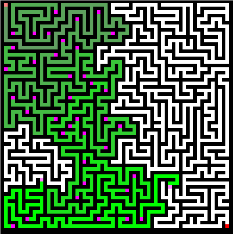
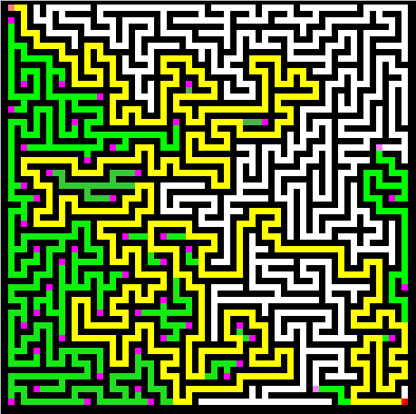
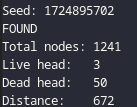
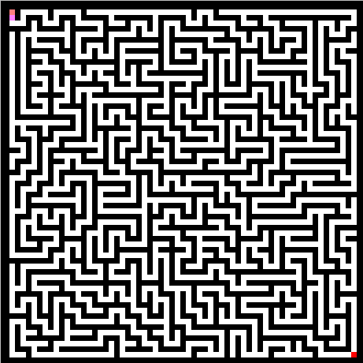

# maze-visualizer

maze-visualizer is a program that generates a 2D Maze through recursive
backtracking then solves it through at real time through Trees forking.



# Visualization
| Winner node               | Output after exiting program | Maze generated
| :---:  		            | :---:    		               | :---:
|     |        | 

## Requirements
- Unix like system
- GCC or clang
- pkg-config
- GNU make
- SDL2
```sh
sudo apt-get install pkg-config libsdl2-dev         # Debian
```
- Standard libraries: argp.h, stdbool, stdlib, inttypes, errno, time.h (These should be already installed)

## Compiling, running and cleaning.
```sh
make                #
make run            # ./maze-visualizer
make clean          # rm maze-visualizer objs/maze-visualizer.o
```

## Options
press [SPACE] or [ENTER] to pause the frame.

- `-h,   --help                        → show this help message and exit`
- `-v,   --version                     → show program's version number and exit`
- `-f,   --fps=NUM                     → frames per second: 60 by default`
- `      --screen_height=PIXELS        → screen height: 480 by default.`
- `      --screen_width=PIXELS         → screen width: 640 by default.`
- `-c,   --maze_columns=NUM            → maze columns: 63 by default.`
- `-r,   --maze_rows=NUM               → maze rows: 63 by default.`
- `      --show_body=BOOL[0 or 1]      → show all the trail that nodes have walked:
                                            1 by default.`
- `      --show_dead_head=BOOL[0 or 1] → show head that can't move: 1 by default.`

## Notes
- Rows and Columns limits are 16bit <1, 32767>
- Maze generation (recursive backtracking) uses odd rows and odd columns
  so if you use even it will get substracted by 1.

## Made by [Sivefunc](https://gitlab.com/sivefunc)
## Licensed under [GPLv3](LICENSE)
